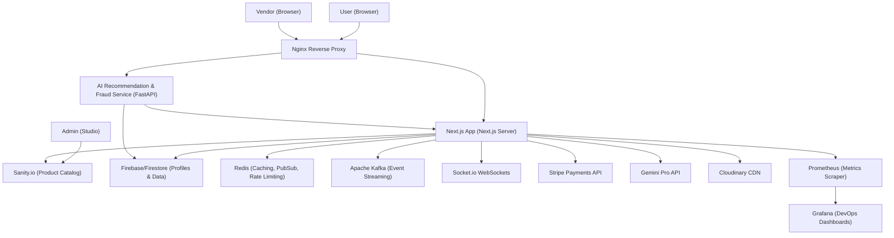

<p align="center">
  <picture>
    <source media="(prefers-color-scheme: dark)" srcset="src/assets/logo_dark.png">
    <source media="(prefers-color-scheme: light)" srcset="src/assets/logo_light.png">
    
  </picture>
</p>

<h1 align="center">DCart</h1>

<p align="center">
  A modern, enterprise-grade, multi-vendor e-commerce platform built with Next.js 14, Shadcn UI, FastAPI, Sanity CMS, Firebase, Stripe, and a robust real-time microservice architecture.
</p> 

It features advanced AI enhancements—such as a Gemini-powered Shopping Copilot, Visual Search, and an automated FastAPI Fraud Detection system—coupled with full DevOps monitoring via Prometheus and Grafana.

---

## System Architecture

The following diagram illustrates how the client interfaces, reverse proxies, application servers, databases, messaging layers, and monitoring stacks interact:



---

## Key Features

### 1. Multi-Vendor Marketplace
- **Separate Portals**: Independent onboarding, product publishing, dispatch management, returns tracking, and payout flows for vendors.
- **Platform Commission**: Custom fee model built directly into checkout pipelines (configurable via environment variables).

### 2. AI & Intelligent Enhancements
- **Shopping Copilot**: A context-aware Gemini AI chatbot that helps users discover products, check stock, and answer queries.
- **Visual Search**: Find products by uploading images, powered by image embedding similarity models.
- **Fraud Detection**: Real-time scoring of checkout transactions via a Python FastAPI microservice utilizing a Random Forest ML model.
- **AI Review Insights**: Automatic reviews parsing and sentiment summaries directly on product pages.

### 3. Real-Time & Event-Driven Engine
- **WebSockets**: Real-time customer support chat and dynamic dashboard alerts powered by Socket.io.
- **Event Streaming**: Asynchronous event publishing and analytics pipelines with Apache Kafka.
- **Caching & Rate Limiting**: Distributed cache and API rate limiting powered by Redis.

### 4. Payments & Dynamic Pricing
- **Stripe Checkout**: Secure payment processing with automated payout splits and checkout session tracking.
- **Dynamic Pricing Engine**: Automated price optimization based on demand, user history, and inventory levels.

### 5. Infrastructure & Monitoring (DevOps)
- **Nginx Reverse Proxy**: Single ingress gateway routing traffic to Next.js or FastAPI.
- **Prometheus Scraper**: Exposes and collects real-time system latency, request count, and memory metrics.
- **Grafana Visualization**: Built-in dashboards to monitor site health, security alerts, and threat vectors.

---

## Technology Stack

| Component | Technology | Description |
| :--- | :--- | :--- |
| **Frontend** | React, Next.js (App Router), Tailwind CSS, Shadcn UI, Redux Toolkit | Server-side rendering, UI components, state management |
| **Databases** | Sanity.io, Cloud Firestore (Firebase) | Content Management System, User Accounts |
| **AI Microservice**| FastAPI, Scikit-Learn (Random Forest) | Machine Learning & Analytics service |
| **Messaging/Cache**| Redis, Apache Kafka | Real-time caching, event streaming, PubSub |
| **WebSockets** | Socket.io | Bidirectional real-time support chat |
| **Payments** | Stripe API | Checkout, invoices, and payouts |
| **Infrastructure** | Docker, Nginx, Prometheus, Grafana | Containerization, ingress routing, metrics |

---

## Project Structure

```
dcart/
├── .github/                 # CI/CD Workflows (GitHub Actions)
├── .vscode/                 # Editor Workspace configurations
├── infrastructure/          # DevOps configs (Nginx, Grafana, Prometheus)
│   ├── nginx/
│   ├── prometheus/
│   └── grafana/
├── recommendation_service/  # Python FastAPI AI & Fraud Detection service
│   ├── fraud_detector.py    # Fraud evaluation logic
│   ├── main.py              # FastAPI application routers
│   └── requirements.txt     # Python dependencies
├── src/                     # Next.js Application Source
│   ├── app/                 # Routes, APIs, and Pages (App Router)
│   ├── assets/              # Static media files (logos, banners)
│   ├── components/          # Reusable React & UI components
│   ├── constants/           # Shared static configuration constants
│   ├── hooks/               # Custom React hooks (real-time listeners, etc.)
│   ├── lib/                 # Core libraries (Redis, Kafka, Gemini, Sanity)
│   └── redux/               # Redux slices and store configuration
├── sanity/                  # Sanity CMS config & schemas
└── tailwind.config.ts       # Tailwind CSS design system
```

---

## Getting Started

### Prerequisites
Make sure you have the following installed on your machine:
- **Node.js** (v18.x or later)
- **Python** (3.10.x or later)
- **Docker & Docker Compose** (for full stack run)

### Step 1: Environment Setup
Clone the template `.env.example` file to create your local configurations:
```bash
cp .env.example .env
```
Fill in the necessary API keys and credentials (Sanity, Stripe, Firebase, Redis, Gemini, etc.) inside the newly created `.env` file.

### Step 2: Running Next.js Locally
Install Node dependencies:
```bash
npm install
```
Start the Next.js development server:
```bash
npm run dev
```
Open [http://localhost:3000](http://localhost:3000) to view the application in your browser.

### Step 3: Running AI Service (FastAPI) Locally
Navigate to the recommendation service folder:
```bash
cd recommendation_service
```
Create a virtual environment and activate it:
```bash
python3 -m venv venv
source venv/bin/activate
```
Install dependencies:
```bash
pip install -r requirements.txt
```
Start the FastAPI server:
```bash
uvicorn main:app --reload --port 8000
```

### Step 4: Running the Infrastructure Stack (Docker Compose)
To start the application along with Nginx, Prometheus, and Grafana:
```bash
docker-compose up --build
```
- **Nginx Ingress**: Access the site through Nginx at [http://localhost:80](http://localhost:80)
- **Grafana Dashboard**: Monitor system metrics at [http://localhost:3000](http://localhost:3000) (Default credentials: admin / admin)
- **Prometheus Console**: Inspect raw scraped metrics at [http://localhost:9090](http://localhost:9090)

---

## License

This project is licensed under the [MIT License](LICENSE).
